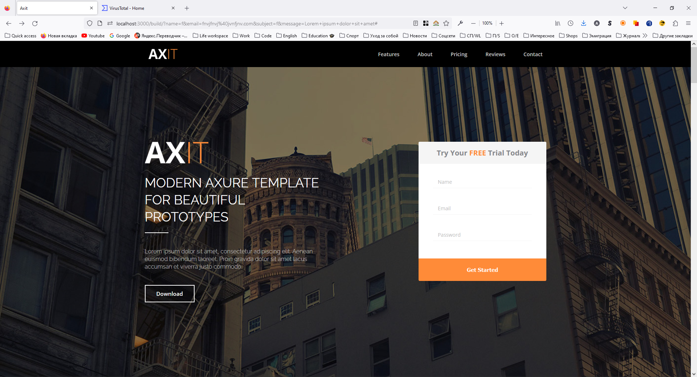

# Axit
## :uk: English
__Description:__ Adaptive landing page

__Deployed project:__ http://axit.alexander-portfolio-and-cv.com

__Used technologies:__

- HTML5
- SCSS
- Adaptive-responsive layout
- Javascript

__About project:__ Axit is modern adaptive landing with smooth animations and adaptive design that looks good on any device. SCSS preprocessor used for more advanced styles. Javascript serves for better functionality.

## :ru: Русский
__Описание:__ Адаптивный лендинг

__Развернутый проект:__ http://axit.alexander-portfolio-and-cv.com

__Использованные технологии:__

- HTML5
- SCSS
- Adaptive-responsive layout
- Javascript

 

__О проекте:__ Axit - это современный лендинг с мягкими анимациями и адаптивным дизайном который хорошо смотрится на любом устройстве. При создании лендинга был использован препроцессор SCSS для создания более продвинутых стилей и Javascript для обеспечения функциональности.

 

## Preview/Превью

